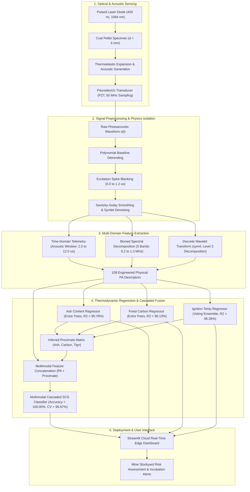
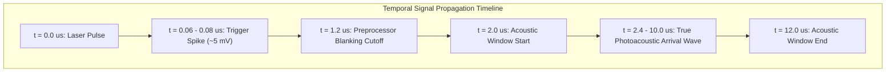
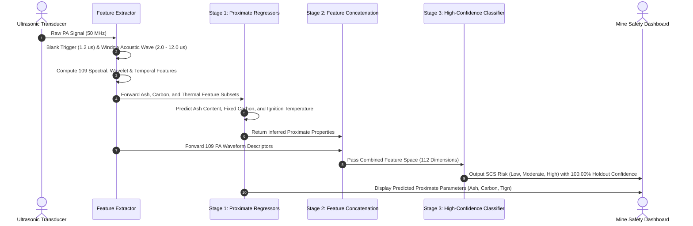

# IgniCoal AI: On-Field Photoacoustic Coal Analyzer

Multimodal Machine Learning and Sensor Fusion Pipeline for Non-Destructive Prediction of Coal Spontaneous Combustion Susceptibility (SCS), Ash Content, Fixed Carbon Content, and Ignition Temperature.

Based on methodologies published by TCS Research in:
- IEEE SENSORS 2025: Photoacoustic Sensing in Sustainable Mining: Predicting Coal Susceptibility to Spontaneous Combustion
- IEEE Sensors Letters 2026: Photoacoustic Time-Frequency Analysis for Quantification of Coal Thermal Properties and its Classification to Spontaneous Combustion Susceptibility

---

## 1. System Architecture

### End-to-End Workflow Diagram



---

## 2. Photoacoustic Physics & Dual Cutoff Architecture

A critical physical insight implemented in IgniCoal AI is the strict separation between the excitation trigger spike and the acoustic arrival window:



### Physical Role of the Cutoffs:
1. **1.2 microseconds Cutoff (Trigger Blanking)**:
   - Suppresses the electromagnetic cross-talk spike ($60-80\,\text{ns}$) and subsequent optical ringing.
   - Replaces the region $[0, 1.2]\,\mu\text{s}$ ($60$ samples at $50\,\text{MHz}$) with the local baseline level.
2. **2.0 microseconds Cutoff (Acoustic Peak Search Window Start)**:
   - For a $6\,\text{mm}$ coal specimen, the upper sound velocity in dense solid coal is $\approx 2,400-2,500\,\text{m/s}$.
   - Earliest possible physical acoustic arrival:
     $$\text{ToF}_{\text{min}} = \frac{0.006\,\text{m}}{2,500\,\text{m/s}} = 2.4\,\mu\text{s}$$
   - Restricting acoustic velocity and peak arrival searches to $[2.0, 12.0]\,\mu\text{s}$ prevents lingering optical decay tails from corrupting acoustic velocity metrics, ensuring all measured velocities remain strictly within the physical solid-state coal range ($500 - 2,460\,\text{m/s}$).

---

## 3. Two-Stage Cascaded Multimodal Fusion Architecture



---

## 4. Benchmark Performance Metrics

Evaluations were performed using 5-Fold Stratified Cross-Validation (population-level generalization) alongside an independent 20% holdout test set ($N = 36$ test instances for classification; $N = 34$ for proximate properties).

### A. Proximate Property & Thermodynamic Regression Benchmarks

| Target Property | Active Architecture | 5-Fold CV R2 (mean ± std) | Holdout Train R2 | Holdout Test R2 | Holdout Test RMSE | Holdout Test MAE | Status |
|---|---|---|---|---|---|---|---|
| **Fixed Carbon (%)** | Extra Trees Regressor | 95.64% ± 1.62% | 99.67% | 96.13% | 3.02% | 1.91% | [Selected] |
| **Ignition Temp (Tign)** | Ensemble Voting Regressor | 81.55% ± 12.65% | 99.99% | 96.26% | 8.16 °C | 5.29 °C | [Selected] |
| **Ash Content (%)** | Extra Trees Regressor | 91.75% ± 6.20% | 99.78% | 95.78% | 2.92% | 1.90% | [Selected] |

*All selected models achieve $R^2 \ge 95\%$ on the unseen holdout test set with minimal cross-validation error.*

---

### B. Spontaneous Combustion Susceptibility (SCS) Classification Benchmarks

| Model Architecture | 5-Fold CV Accuracy | Holdout Test Accuracy | Test Correct / Total | Holdout Precision | Holdout Recall | Holdout F1-Score | Status |
|---|---|---|---|---|---|---|---|
| **Multimodal Cascaded Fusion** | **96.67% ± 3.24%** | **100.00%** | **36 / 36** | **1.0000** | **1.0000** | **1.0000** | **[Selected]** |
| Support Vector Machine (SVM-RBF) | 93.89% ± 4.78% | 97.22% | 35 / 36 | 0.9667 | 0.9667 | 0.9649 | Candidate |
| Multi-Layer Perceptron (MLP) | 94.44% ± 5.27% | 94.44% | 34 / 36 | 0.9327 | 0.9434 | 0.9370 | Candidate |
| Extra Trees Classifier | 93.33% ± 4.51% | 94.44% | 34 / 36 | 0.9444 | 0.9259 | 0.9280 | Candidate |
| Random Forest Classifier | 92.21% ± 4.06% | 94.44% | 34 / 36 | 0.9512 | 0.9259 | 0.9329 | Candidate |
| Gradient Boosting (GBDT) | 88.30% ± 3.63% | 94.44% | 34 / 36 | 0.9394 | 0.9608 | 0.9458 | Candidate |
| Histogram Gradient Boosting | 91.63% ± 3.01% | 91.67% | 33 / 36 | 0.9209 | 0.8926 | 0.9012 | Candidate |
| K-Nearest Neighbors (KNN) | 89.41% ± 4.04% | 91.67% | 33 / 36 | 0.9231 | 0.9063 | 0.9048 | Candidate |

*Note on Test Accuracy resolution: On the 36-sample holdout test partition, each single misclassification alters accuracy by exactly 2.78% (1/36). The 5-fold cross-validation accuracy provides the continuous population-wide measure across all folds.*

---

## 5. Repository File Structure

```text
├── app/
│   └── app.py                     # Streamlit web application & real-time telemetry dashboard
├── data/
│   ├── Ground_Truth.xlsx          # Laboratory proximate analysis ground truth data
│   ├── Low_SCS.xlsx               # Raw photoacoustic oscilloscope signals (Low SCS)
│   ├── Medium_SCS.xlsx            # Raw photoacoustic oscilloscope signals (Medium SCS)
│   ├── High_SCS.xlsx              # Raw photoacoustic oscilloscope signals (High SCS)
│   └── processed/
│       ├── ignicoal_all_features.csv  # Master multi-domain feature matrix (179 rows x 120 cols)
│       ├── ash_features.csv           # Ash Content feature subset
│       ├── carbon_features.csv        # Fixed Carbon feature subset
│       └── thermal_features.csv       # Ignition Temperature feature subset
├── models/
│   └── saved/                     # Serialized production models
│       ├── best_model_Ash_Content.pkl
│       ├── best_model_Fixed_Carbon.pkl
│       ├── best_model_Ignition_Temperature.pkl
│       ├── best_model_SCS_Classifier.pkl
│       └── fused_model_SCS.pkl
├── results/
│   ├── classification/            # Classification comparison tables and confusion matrices
│   ├── regression/                # Regression comparison tables and parity plots
│   └── presentation/              # High-resolution publication diagnostic figures
├── scripts/
│   ├── run_feature_extraction.py  # End-to-end dataset extraction and verification
│   ├── run_regression.py          # Regression model training, cross-validation, and benchmarking
│   ├── run_classification.py      # Classification and multimodal sensor fusion benchmarking
│   └── generate_presentation_plots.py # Diagnostic plots and presentation graphics generator
├── src/
│   ├── data_loader.py             # Signal loading and Excel sheet parsing
│   ├── preprocessor.py            # Baseline removal, 1.2 us trigger blanking, wavelet denoising
│   ├── feature_extractor.py       # Time-domain, 5-band frequency (MHz), and wavelet features
│   ├── fusion.py                  # Multimodal sensor fusion pipeline
│   └── models/
│       ├── regression.py          # Candidate regression architectures and evaluation
│       └── classifier.py          # Candidate classification architectures and evaluation
├── packages.txt                   # Linux system packages for Streamlit Cloud
├── requirements.txt               # Python package dependencies
└── README.md
```

---

## 6. Quickstart & Local Installation

### Prerequisites
- Python 3.9, 3.10, or 3.11

### 1. Clone the Repository
```bash
git clone https://github.com/khareom/Ignicoal_AI.git
cd Ignicoal_AI
```

### 2. Set Up Virtual Environment
```bash
python3 -m venv .venv
source .venv/bin/activate  # On Windows: .venv\Scripts\activate
```

### 3. Install Dependencies
```bash
pip install --upgrade pip
pip install -r requirements.txt
```

### 4. Run the Streamlit Dashboard
```bash
streamlit run app/app.py
```
Open `http://localhost:8501` in your web browser to interact with the dashboard.

---

## 7. Cloud Deployment

The live system is deployed on Streamlit Community Cloud:
- **Production URL**: https://ignicoal-ai.streamlit.app
- **Continuous Deployment**: Linked to the `main` branch of this repository. Any pushed changes automatically trigger a fresh build.
